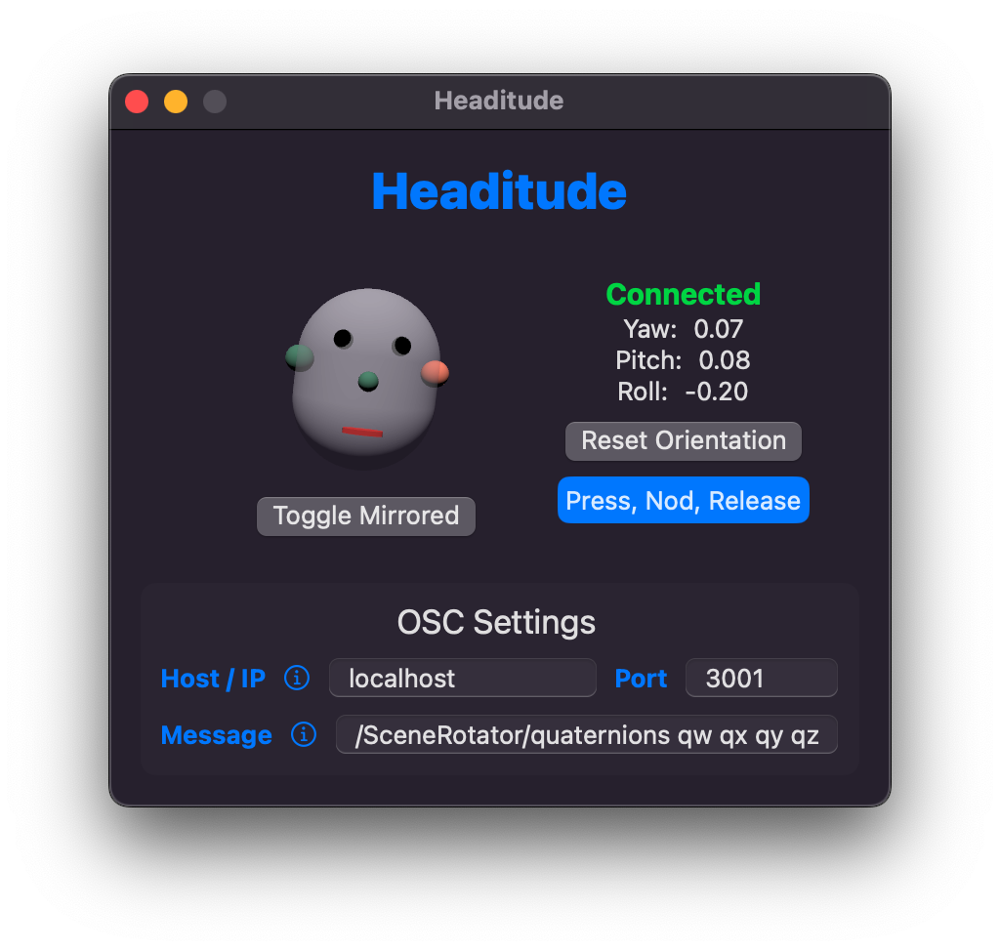

# Headitude
AirPods Orientation to OSC Sender



Starting with macOS Sonoma 14.0 it is possible to access the orientation data of Apple AirPods using the CoreMotion framework.
The **Headitude** app reads the orientation data and forwards it via OSC to a specified IP address and port.

**:warning: Note**: The app is in an early stage of development and might not provide peak user experience just yet.

### Custom OSC Message

The OSC message can be customized:

```
/<osc/address> <token> <token>
```

The tokens will then be replaced by float values.

E.g. for the [IEM SceneRotator](https://plugins.iem.at) VST plug-in you might want to use:

```
/SceneRotator/ypr yaw pitch roll
```

Currently the following tokens are supported:
- `yaw` Yaw-angle in degrees [-180, 180]
- `yaw+` Yaw-angle in degrees [0, 360]
- `pitch` Pitch-angle in degrees
- `pitch+` Pitch-angle in degrees [0, 360]
- `roll` Roll-angle in degrees
- `roll+` Roll-angle in degrees [0, 360]

You can prepend a token with a `-` to flip the sign.

There are more tokens to come, e.g. angles in radians and quaternions.

