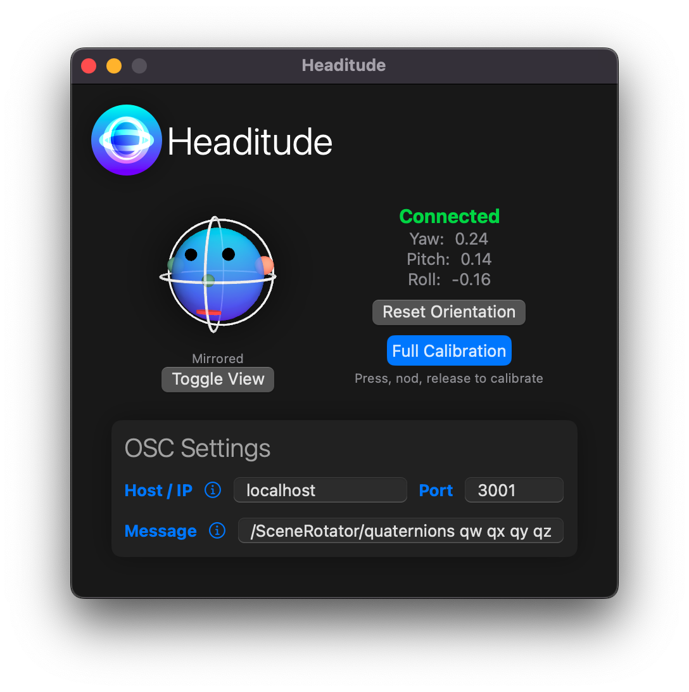

# Headitude
AirPods Orientation to OSC Sender



Starting with macOS Sonoma 14.0 it is possible to access the orientation data of Apple AirPods
using the [CoreMotion](https://developer.apple.com/documentation/coremotion) framework.
The **Headitude** app reads the orientation data and forwards it via OSC to a specified IP address and port.

**:warning: Note**: The app is in an early stage of development and might not provide peak user experience just yet. It's
my first Swift/SwiftUI app, so don't expect best practices. :wink: But please let me know if you have any suggestions!! :pray:

### Calibration
The app doesn't know how you wear your AirPods. Therefore you need to calibrate the orientation data. Luckily,
my calibration routine is very quick, and can be done in a fraction of a second (if you're fast enough).

While you are wearing your AirPods:
- look forward
- press and hold the `Press, Nod, Release` button
- nod your head down
- while looking down, release the button
- :tada: you're done!

Internally, it uses the gravity data and some quaternion magic to calculate the calibration data. :sparkles:

You can do a soft reset to reset the front direction by pressing the `Reset Orientation` button.

The calibration data is stored in the user defaults and will be loaded on the next start of the app.
:floppy_disk:

### Custom OSC Message

The OSC message can be customized:

```
/<osc/address> <token> <token>
```

The tokens will then be replaced by float values.

E.g. for the [IEM SceneRotator](https://plugins.iem.at) VST plug-in you might want to use:

```
/SceneRotator/ypr yaw pitch roll
```

Currently the following tokens are supported:
- `yaw` Yaw-angle in degrees [-180, 180]
- `yaw+` Yaw-angle in degrees [0, 360]
- `pitch` Pitch-angle in degrees [-180, 180]
- `pitch+` Pitch-angle in degrees [0, 360]
- `roll` Roll-angle in degrees [-180, 180]
- `roll+` Roll-angle in degrees [0, 360]

- `yawRad` Yaw-angle in radians [-pi, pi]
- `yawRad+` Yaw-angle in radians [0, 2pi]
- `pitchRad` Pitch-angle in radians [-pi, pi]
- `pitchRad+` Pitch-angle in radians [0, 2pi]
- `rollRad` Roll-angle in radians [-pi, pi]
- `rollRad+` Roll-angle in radians [0, 2pi]
-
- `qw` Quaternion w
- `qx` Quaternion x
- `qy` Quaternion y
- `qz` Quaternion z

**Note**: You can prepend a token with a `-` to flip the sign, e.g. `-yaw` or `-yawRad`.
